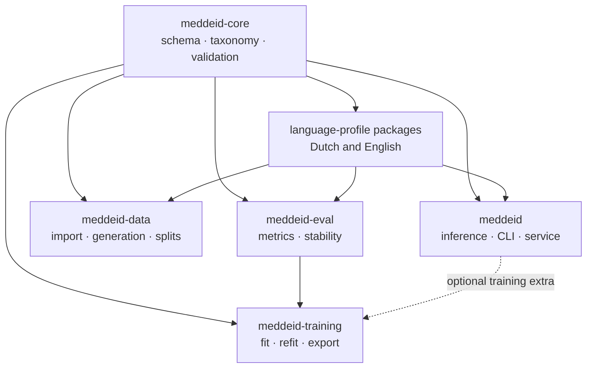
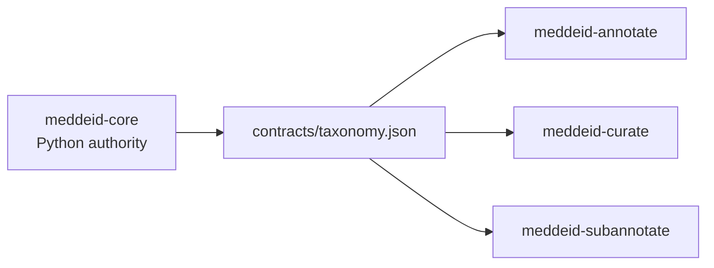

# Suite architecture

MedDeID is a language-extensible family of independently versioned repositories,
not a runtime monorepo. Each package has one responsibility and declares every
dependency it needs. Public model bundles and language packages support Dutch
and English, while shared contracts and workflows allow additional languages.

## Dependency direction

The three browser applications consume generated copies of the core taxonomy contract. They do not define an alternative schema.

## Layers

| Layer | Components | Owns |
|---|---|---|
| Contract | `meddeid-core` | Record shape, taxonomy, offsets, normalization, validation |
| Language | `meddeid-language-*` packages | Language rules, locale profiles, and versioned resources |
| Runtime | `meddeid` | Model loading, tokenization, decoding, post-processing, local serving |
| Data | `meddeid-data` | Source import, stable identities, splits, synthetic generation |
| Human review | `meddeid-annotate`, `meddeid-curate`, `meddeid-subannotate` | Primary annotation, optional reconciliation, benchmark subannotation |
| Experiment | `meddeid-training`, `meddeid-eval` | Training protocol, export, metrics, stability |
| Artifacts | Hugging Face and Zenodo repositories | Published model, datasets, guidelines, checksums |

## How the separation helps you

The components are separated so you can use the part of MedDeID that matches
your task without installing or operating the entire suite.

### Install only what you need

For ordinary de-identification, install `meddeid`. Dataset preparation,
annotation, evaluation, and training are separate tools and are needed only for
those workflows. Add the optional server dependencies only when an application
needs to call MedDeID over HTTP.

This keeps a basic inference environment smaller and gives production and
research workflows independent dependency and release boundaries.

### Select language behavior explicitly

Every MedDeID tool uses the same record structure and label taxonomy. Dutch,
English, and future languages add their own regional rules without changing
that shared format.

Models declare which regional profiles they support. You select the model and,
when required, a profile such as `nl-BE`, `en-GB`, or `en-US`. The same
annotation, training, and evaluation workflow can therefore support another
language without creating a separate version of the suite.

### Pass work between tools as files

The tools do not need to run together as one application. Dataset preparation,
human review, training, and evaluation exchange validated files and manifests,
so each step can run in the environment appropriate for it while retaining a
record of what produced the result.

Optional stages stay optional. Use curation when a project has multiple
independent reviewers. Add detailed subannotations only when building a
benchmark that needs character-level evaluation.

### Install released components, not the suite workspace

Most users install Python packages or run published container images. The
grouped `meddeid-suite` checkout is for maintainers who coordinate and verify
releases; it is not required at runtime.

### Keep comparison systems independent

External systems such as Belgian DEDUCE run in their own environments. Convert
their predictions to the MedDeID result format before evaluating them with
`meddeid-eval`. This avoids mixing dependencies and licences while still
allowing results to be compared consistently.
