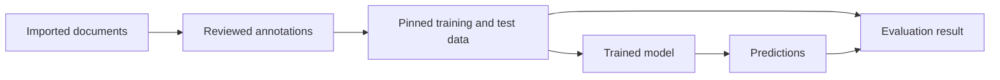

# Artifact lineage

Artifact lineage lets you answer a practical question later: which exact data,
model, and settings produced this result?

MedDeID records this information in small manifest files. Keep a manifest with
the file it describes when you move work between tools, people, or systems. A
later step can then confirm that it received the intended version rather than a
similarly named file.

## The data and its manifest have different jobs

A JSONL file contains documents, annotations, or predictions. Its manifest
describes how that file should be interpreted and where it came from.

For example, packaging a completed reviewer assignment creates a manifest like
this:

```json
{
  "manifest_version": "meddeid.annotation-set.v1",
  "annotation_set_id": "hospital-a-round-1",
  "status": "completed",
  "annotator_id": "reviewer-7",
  "contracts": {
    "schema_version": "meddeid.schema.v1",
    "offset_unit": "unicode_codepoints",
    "taxonomy_contract_version": 1,
    "taxonomy_version": "ProductionLabels-v1.1"
  },
  "files": {"annotations": "reviewer-a.jsonl"},
  "hashes": {"annotations_sha256": "<sha256>"}
}
```

This tells the next tool that the review was completed, which annotation set it
belongs to, which data contract it follows, and which exact file was packaged.
If the file's checksum no longer matches, the file has changed and should not
be treated as that completed submission.

You normally do not write these manifests by hand. Use the workflow command
that prepares an output for its next step; MedDeID then records the relevant
identity, contract, and checksum information.

## How the record follows your workflow

The main lineage path looks like this:



At each durable handoff, the new artifact records its direct inputs. Following
those references backwards connects an evaluation result to the predictions
and test data, then to the model, training data, and reviewed source
annotations that produced them.

Curation and detailed evaluation annotations are optional. When you use them,
they add their own checked handoffs to the same chain; they do not change the
basic principle.

## What each identifier tells you

Different identifiers answer different questions:

| Identifier | What it tells you | When it changes |
|---|---|---|
| `document_id` | Which source document this is within the project | When the project namespace or source identity changes |
| `annotation_set_id` | Which completed reviewer submission this is | When you create a new submission |
| `span_id` | Which labeled range in a document this is | When its document, boundaries, or label changes |
| SHA-256 checksum | Whether a file contains the exact same bytes | After any byte-level change, including reformatting or row order |
| Model revision or bundle checksum | Which exact model version produced a result | When the published revision or local bundle changes |

A document keeps its `document_id` when files are renamed, copied, or sorted.
Importing the same source record into the same project also preserves that ID.
Filenames and row positions are therefore useful for navigation, but they are
not durable identities.

For private clinical data, MedDeID can derive document IDs with a
project-specific secret. Keep that secret and the mapping back to source IDs in
the protected project area; do not include either in a shared artifact.

## When an upstream file changes

Correct the earliest authoritative file, then regenerate the outputs that
depend on it. A checksum mismatch is a warning that an existing downstream
artifact refers to an older version; changing the checksum by hand would hide
that fact rather than repair the lineage.

For example, if a reviewed annotation is corrected, package the corrected
annotation set again and recreate or revalidate any derived training data,
predictions, or evaluation results. `meddeid-subannotate` can identify which
detailed review work remains reusable and which changed spans need review
again.

## What to keep with a result

For a quick local exploration, you may only need the immediate output. If you
save or pass on that output, keep any generated manifest with it.

For a study, validated workflow, or production release, also retain:

- the input, gold-data, and prediction manifests;
- the immutable model revision or local bundle checksum;
- the package and language-profile versions;
- the training, inference, and evaluation configuration;
- the commands used and the resulting metrics; and
- relevant runtime or hardware information.

Keep protected source text, reversible ID mappings, and project secrets under
their own access controls. Review manifests before sharing them outside that
environment because they can contain reviewer identifiers, filenames, or other
operational details.

See [Prepare and annotate data](../workflows/prepare-and-annotate.md) for the
annotation handoff, and [Train and evaluate](../workflows/train-and-evaluate.md)
for the records to retain with an experimental result.
