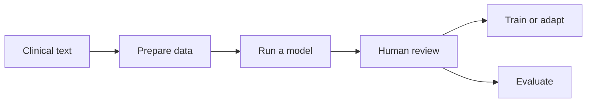

Open-source clinical privacy tooling

# Remove identifiers from clinical text—locally

MedDeID helps healthcare and research teams detect and remove identifying
information from clinical notes while keeping normal processing inside their
own infrastructure. Public model bundles support Dutch and English.

[Install and run](start/quickstart.md){ .md-button .md-button--primary }
[Try the public demo](https://huggingface.co/spaces/stighellemans/meddeid-demo){ .md-button }
[View source](https://github.com/stighellemans/meddeid){ .hero-text-link }

The hosted demo is for synthetic examples only. Process sensitive text locally.

<strong>Local and offline</strong>
Keep patient text within your governance boundary.

<strong>Multilingual by design</strong>
Dutch and English are available today, with room to add more languages.

<strong>One complete interface</strong>
Python, CLI, batch, Docker, and HTTP service.

<strong>Open source</strong>
Inspect, validate, adapt, and deploy the full workflow.

!!! warning "De-identification is not a guarantee of anonymity"
    Validate MedDeID on representative data from your setting. Use human review and institutional controls whenever a missed identifier could expose sensitive information.

## See what MedDeID does

The example below is synthetic. MedDeID returns both redacted text and
structured character-offset spans, so downstream systems can preserve an audit
trail.

Synthetic input

Dr. Lisa Wong saw patient Alex Example at Riverside Clinic on 14 March 2026.

→

De-identified output

`[Name:Caregiver]` saw patient `[Name:Patient]` at
`[Organization:Healthcare]` on `[Date]`.

## One workflow, adaptable to more languages

MedDeID connects the full journey from preparing clinical text to reviewing annotations, training models, and evaluating results. You can use the complete workflow or only the parts your project needs.

Public model bundles support Dutch and English. Additional language models and
language-specific rules can be added while reusing the same annotation,
training, and evaluation tools.

For the technical details, see the [suite architecture](concepts/architecture.md) and [data contract](concepts/data-contract.md).

## Public models and datasets

The Dutch and English models, synthetic development corpora, and independent
synthetic benchmarks are collected on
[Hugging Face](https://huggingface.co/collections/stighellemans/meddeid).
Patient text is processed locally during normal package use; downloading a
model is the only network step unless you deliberately use a hosted service.

[See all public artifacts](artifacts/index.md)

Open collaboration

## Help bring MedDeID to more languages

We want to work with hospitals, care organizations, research groups, language experts, and open-source engineers. Local clinical knowledge, representative validation, language resources, annotation expertise, and technical contributions can help MedDeID support new languages responsibly.

[Discuss a collaboration](mailto:stig.hellemans@uantwerpen.be){ .md-button .md-button--primary }
[Ways to contribute](project/contributing.md){ .md-button }

Please do not send patient text or other sensitive data by email.

