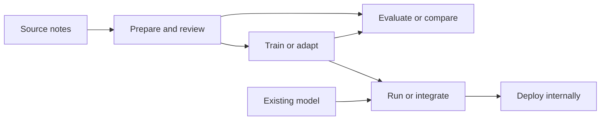

# Choose a workflow

Start with the outcome you need. Each workflow explains which tools to use,
what files you will create, and where those files go next. If you have not run
MedDeID before, begin with [Install and run](../start/quickstart.md).

!!! tip "Planning a multi-step study?"
    Run `meddeid start` when you want MedDeID to guide you through a longer
    workflow and keep its decisions and progress together. It asks what you
    want to accomplish, helps you choose the appropriate workflow, and creates
    a workspace for continuing it later.

    ```bash
    meddeid start
    ```

    The assistant does not choose your study design for you. See the
    [workflow CLI reference](../reference/workflow-cli.md) when you are ready
    to create and use a workspace.

<div class="path-grid" markdown>

<div class="path-card" markdown>
### De-identify text

Process one note or a batch with the command line, or add local inference to a
Python application.

[Follow the inference steps →](inference.md)

</div>

<div class="path-card" markdown>
### Run MedDeID as an internal service

Choose CPU, NVIDIA GPU, or native Apple silicon for the HTTP API, then place the
service inside your institution's security and operational controls.

[Prepare a deployment →](production-deployment.md)

</div>

<div class="path-card" markdown>
### Prepare and annotate data

Import exported notes, review the identifiers in each document, and reconcile
multiple reviewers only when your project requires it.

[Prepare and annotate data →](prepare-and-annotate.md)

</div>

<div class="path-card" markdown>
### Train a model

Train from reviewed development data and measure the resulting model on an
independent test set.

[Train and evaluate →](train-and-evaluate.md)

</div>

<div class="path-card" markdown>
### Adapt a model to your setting

Test whether additional reviewed data from a hospital, speciality, or document
type improves an existing model fairly.

[Plan domain adaptation →](domain-adaptation.md)

</div>

<div class="path-card" markdown>
### Evaluate or compare systems

Score predictions against reviewed test data and compare systems under the
same evaluation conditions.

[Evaluate predictions →](train-and-evaluate.md#5-evaluate-predictions)

</div>

<div class="path-card" markdown>
### Add another language

Understand the language package, model bundle, validation, documentation, and
collaboration work involved.

[See how to add a language →](../project/contributing.md#what-adding-a-language-involves)

</div>

</div>

## How the workflows fit together

The workflows can be used separately or connected. A one-time de-identification
run does not require an annotation or training project. A model-development
project usually moves through preparation, review, training, and evaluation
before the exported model is used for inference or deployment.



Whichever route you choose:

- keep source notes and the private ID mapping inside the approved data
  boundary;
- use separate writable files for reviewer work instead of changing the
  imported source artifact;
- preserve the manifests and settings that connect data, models, predictions,
  and results; and
- keep test answers out of training decisions when reporting model quality.

For component responsibilities and package boundaries, see the
[suite architecture](../concepts/architecture.md) and
[component reference](../reference/components.md).
