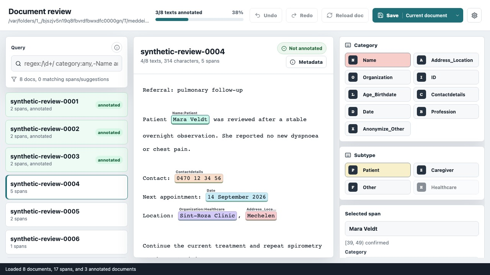
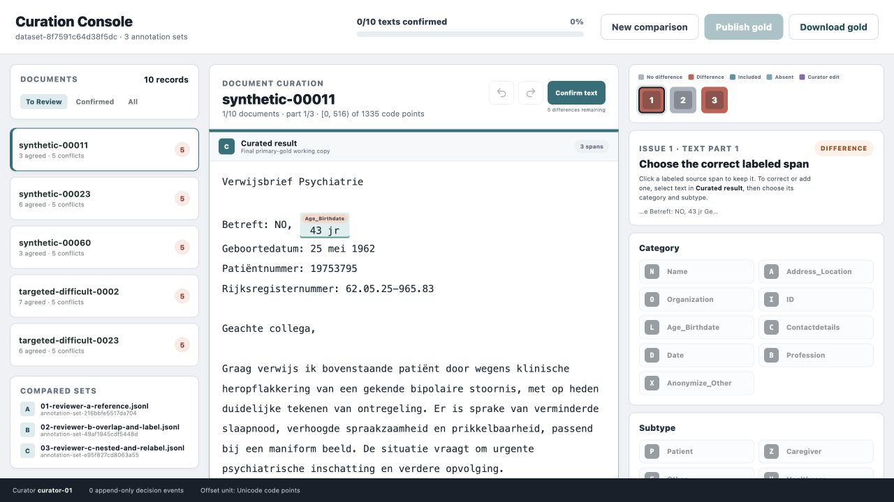
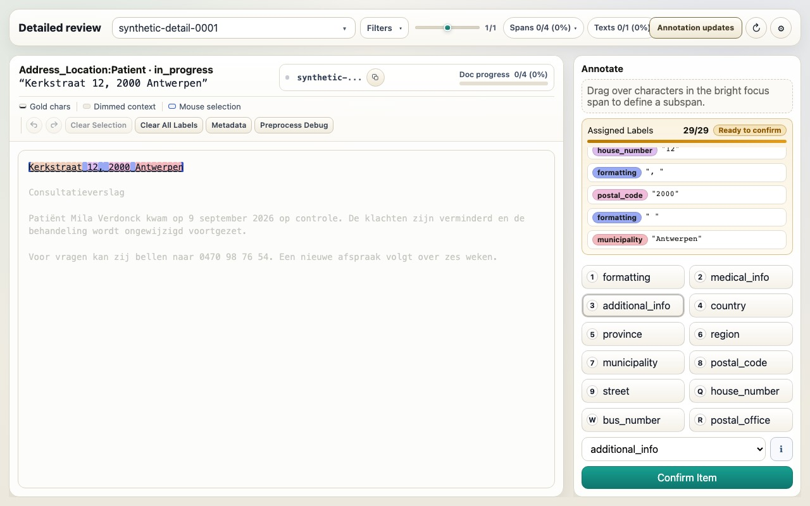

# Prepare and annotate data

Use this workflow to turn exported notes into a reviewed dataset for training,
evaluation, or research. The notes stay on your machine: Python commands
prepare the files, and local browser applications let reviewers inspect and
correct them.

```text
source notes → imported dataset → optional fixed split → reviewer assignments
             → human review → optional curation → optional detailed labels
```

If you only want to de-identify notes and do not need a reviewed dataset, use
[Local inference](inference.md) instead.

## Choose the path you need

| Your goal                                | Follow this path                                                              |
| ---------------------------------------- | ----------------------------------------------------------------------------- |
| Create one reviewed collection           | Import → open an assignment → review → export                                 |
| Prepare data for training and evaluation | Import → split → open and review one assignment per split → export            |
| Reconcile two or more reviewers          | Complete the path above for every reviewer, then curate each split separately |
| Add character-level benchmark labels     | Start from completed primary annotations, then use subannotation              |

Curation and detailed subannotation are optional. A project with one
authoritative reviewer can stop after exporting the completed assignment.

## Before you begin

For an end-to-end research project, create a virtual environment and install
the compatible Python tools together:

```bash
python3 -m venv .venv
source .venv/bin/activate
python -m pip install --upgrade pip
python -m pip install 'meddeid[research]'
```

If you only need to import data, install the smaller `meddeid-data` package:

```bash
python -m pip install meddeid-data
```

Install `meddeid` later only if assignments should begin with model
suggestions. The browser applications run through one Docker Compose setup and
are not installed by `pip`.

!!! warning "Keep clinical data local"
The browser applications have no built-in user authentication. The
commands below bind them to localhost. Run them on an approved machine and
do not expose their ports to a network. See [Privacy and
security](../project/privacy-and-security.md) for the wider data-handling
boundary.

## 1. Import the source notes

<span class="source-label">Owner: meddeid-data</span>

Create a project and import a table by identifying its document-ID and text
columns:

```bash
meddeid-data project create my-project notes.csv \
  --namespace hospital-study \
  --language-profile nl-BE \
  --id-column note_id \
  --text-column note_text
```

The same command accepts:

- CSV or TSV tables;
- Parquet tables after installing `meddeid-data[parquet]`; or
- a directory of UTF-8 `.txt` files.

For a text-file directory, omit the column options. For a table, columns other
than the selected ID and text columns are retained as document metadata by
default. More complex patient and caregiver column mappings are documented in
the [`meddeid-data` import guide](https://github.com/stighellemans/meddeid-data#create-an-annotation-ready-dataset).

The import creates `my-project/artifacts/annotations.jsonl`: one standardized
record per note, ready for inference and review. It also creates a manifest
that records how the source was imported.

If an existing JSONL already has one document per line but uses field names
such as `doc_id`, `raw_text`, or `start_char`, use the limited normalizer
described under [Standardize supported field
names](../concepts/data-contract.md#standardize-supported-field-names). It is
not the importer for CSV, Parquet, or text-file directories.

### Protect the source mapping

MedDeID replaces source IDs with stable project IDs. The private key and the
mapping back to the source records are stored under `my-project/private/`.

!!! danger "Protect the private directory"
The private mapping can reconnect project IDs to source records. Keep it
inside the approved data boundary, restrict access, and back it up with the
project. Do not include it in a dataset release.

??? info "If the first import fails"
A failed first import keeps the empty project and its private key. Correct
the column mapping and repeat `project create` with the same namespace and
language profile, or run the recovery command printed by MedDeID:

    ```bash
    meddeid-data project import my-project notes.csv \
      --id-column note_id \
      --text-column note_text
    ```

    Once a project contains imported, split, or reviewed data, `project create`
    will not overwrite it. Use `project import` only when you deliberately want
    to replace the imported dataset.

## 2. Fix the split before review when training

Skip this step when you need one reviewed collection rather than separate
training and test data.

For model training, domain adaptation, or a formal evaluation, assign the
documents to their roles before model output or reviewer observations can
influence the choice:

```bash
meddeid-data project split my-project \
  --seed 42 \
  --train 0.8 \
  --validation 0.1
```

This writes `train.jsonl`, `validation.jsonl`, and `test.jsonl` under
`my-project/splits/`. The remaining 10% becomes the test set.

These files fix which documents have each role; they are not the files that
reviewers edit. Training decisions may use the train and validation results.
Keep the test annotations separate until the model and evaluation procedure
have been fixed.

## 3. Choose the reviewer's starting data

Annotate imports a JSONL file and creates a separate working assignment inside
its workspace. The imported source stays unchanged. **Model suggestions** are
identifier spans that a model has already highlighted for the reviewer to
check. Without suggestions, the note text is present but the reviewer starts
with no highlighted identifiers and marks every identifier themselves. Either
route still requires review of the complete text.

### Option A: begin with model suggestions

Install inference if it is not already available:

```bash
python -m pip install meddeid
```

For one unsplit collection:

```bash
mkdir -p my-project/review-inputs
meddeid batch my-project/artifacts/annotations.jsonl \
  --output my-project/review-inputs/all-with-suggestions.jsonl \
  --model stighellemans/meddeid-dutch-synth
```

For a split project, prepare train and validation with suggestions. Keep the
test input free of predictions from the system that will be evaluated:

```bash
mkdir -p my-project/review-inputs

for split in train validation; do
  meddeid batch "my-project/splits/${split}.jsonl" \
    --output "my-project/review-inputs/${split}-with-suggestions.jsonl" \
    --model stighellemans/meddeid-dutch-synth
done
```

Import `my-project/splits/test.jsonl` directly when creating the test
assignment. This keeps errors from the evaluated system from steering its gold
labels. Suggestions from a different system are appropriate only when the
study design permits and records that choice.

The example model is a Dutch synthetic-data baseline. Choose a model and
language profile that match the notes, and prefer an institution-validated
bundle when one is available. Suggestions are only a starting point: reviewers
must correct missed, unnecessary, mislabelled, or incorrectly bounded spans.

### Option B: begin without model suggestions

Skip `meddeid batch`. In Annotate, choose **Import dataset** and select the
original annotation-ready file:

```text
# One collection
my-project/artifacts/annotations.jsonl

# Or one part of a split project
my-project/splits/test.jsonl
```

The notes open without pre-highlighted identifiers, so the reviewer marks all
identifier spans manually. Annotate preserves the imported file and saves the
work in its own assignment.

### Keep reviewers independent

Create a separate workspace assignment for every reviewer. Two reviewers may
import the same starting JSONL, but each assignment needs its own name, such as
`Train · Reviewer A` and `Train · Reviewer B`. Never ask two reviewers to open
the same assignment: their work must remain independent until curation.

## 4. Start the workspace and review

<span class="source-label">Owner: meddeid-annotate</span>

The suite provides one Compose setup for all three browser tools. Run the
following commands from the directory that contains
`compose.annotation-workspaces.yaml`. Set the workspace to an absolute path
inside your project, then start the services once:

```bash
export MEDDEID_ANNOTATION_WORKSPACE="$PWD/my-project/browser-workspace"
docker compose -f compose.annotation-workspaces.yaml up --detach --build
```

This starts three containers; the single Compose command manages them together:

| Application | Address                 | Purpose                                |
| ----------- | ----------------------- | -------------------------------------- |
| Annotate    | `http://127.0.0.1:5186` | Review primary identifier spans        |
| Subannotate | `http://127.0.0.1:5187` | Add optional detailed benchmark labels |
| Curate      | `http://127.0.0.1:5188` | Reconcile independent reviewers        |

The screenshots below show the released 0.3.1 applications with synthetic
clinical examples. No real patient data is shown.

{ .annotation-app-screenshot loading=lazy }

<p class="annotation-app-caption"><strong>Annotate:</strong> review the complete note while adding, removing, resizing, or relabelling primary identifier spans.</p>

Open Annotate and choose **Import dataset**. Select the starting JSONL from
step 3, then give it a recognizable dataset and assignment name—for example,
`Hospital study` and `Train · Reviewer A`. Each import creates an isolated
assignment with its own preserved source, working copy, progress, and exports.

The assignment library lets reviewers switch work in the browser. It restores
the saved review and last document when they return. If the current document
has unsaved changes, use **Save & switch**. Downloading a bundle is not needed
to save or resume work.

Expand **Workspace** when you need to change the
assignment, inspect storage, or export a bundle.

The document list lets a reviewer choose what to work on, filter the list, and
optionally continue to the next pending document after saving. For each
document:

1. read the complete text, not only the highlighted spans;
2. add, remove, relabel, or resize spans as needed; and
3. save the document to mark that complete text as reviewed.

Save documents that contain no identifiers as well. Their empty `spans` list
plus completed state records that a person reviewed the text and found
nothing — it is different from a document nobody has checked yet.

## 5. Keep or export a completed assignment

Annotate continuously saves work inside the mounted workspace. Open **Files &
results** to see the exact source, working, and export locations.

Once every document is reviewed, choose **Export bundle**. The timestamped ZIP
contains:

- the preserved source JSONL;
- the completed `annotations.jsonl`;
- `annotations.manifest.json`, which records its checksum and data contracts;
- the saved working state; and
- a workspace manifest describing the assignment and review progress.

An export made before review is complete is clearly marked as an in-progress
snapshot and is not a completed annotation set. Exporting is optional for
ordinary saving and resuming; use it when the result must leave the workspace,
be retained as a portable snapshot, or move outside this shared workspace.
Curate and Subannotate can select completed assignments directly.

Use a pseudonymous reviewer ID in the assignment name or study record rather
than a name or email address. If one reviewer is authoritative, their completed
`annotations.jsonl` is the reviewed result and curation can be skipped.

## 6. Reconcile multiple reviewers only when required

<span class="source-label">Owner: meddeid-curate</span>

Use `meddeid-curate` when two or more people independently reviewed the same
documents. It retains exact agreement automatically and asks a curator to
decide where their spans differ.

{ .annotation-app-screenshot loading=lazy }

<p class="annotation-app-caption"><strong>Curate:</strong> compare independent reviewer lanes, resolve only their differences, and confirm the whole document before publishing gold data.</p>

Open Curate at `http://127.0.0.1:5188` and choose **New comparison → From
workspace**. Select the completed reviewer assignments for one split, then
enter a dataset name, comparison name and pseudonymous curator ID. Every
selected assignment must contain the same document IDs and unchanged text.
Explicit split labels must agree. Curate keeps frozen input copies with their
assignment identities and checksums; downloading, extracting, renaming or
repackaging reviewer files is not required.

Use **Import files** when completed reviewer JSONLs and matching manifests
come from outside this shared workspace. Those input filenames must be unique.

The document list lets the curator choose the current document and filter the
list to **To review**, **Confirmed**, or **All**. Documents may be handled in
any order. Resolve the differences, inspect the complete text, and confirm
each document. Publishing remains unavailable until every document in this
comparison is confirmed.

Publishing preserves a finalized version under the comparison's own folder:

```text
my-project/browser-workspace/curate/<comparison-id>/
├── assignment.json
├── inputs/                              # frozen reviewer inputs
├── work/project.json                    # saved decisions and progress
└── results/<version>/
    ├── annotations.jsonl
    ├── decisions.jsonl
    ├── manifest.json
    └── result.json
```

`annotations.jsonl` is the curator-approved primary gold. `decisions.jsonl`
records how disagreements were resolved, and the manifests bind the result to
its inputs and checksums. **Files & results** shows the exact paths and
preserved versions. Export a bundle when a portable copy is needed.

Use **Workspace** to switch comparisons or return to **All comparisons**.
Starting a comparison for validation or test keeps the existing comparison and
its audit history. Later edits require publishing a new version; previous
finalized versions remain available. There is no manual archive step and no
container restart between splits.

These workspace features are provided by the local Compose builds. Standalone
Curate without `MEDDEID_WORKSPACE_DIR` still uses the legacy single-project
workflow. A previous `curate/project.json` in the shared workspace is copied
once into the comparison library, leaving the original files untouched.

## 7. Add detailed labels only for detailed evaluation

<span class="source-label">Owner: meddeid-subannotate</span>

Ordinary training and span-level evaluation do not require this step.
`meddeid-subannotate` divides confirmed identifier spans into smaller character
segments for benchmarks that measure exactly which parts were removed.

{ .annotation-app-screenshot loading=lazy }

<p class="annotation-app-caption"><strong>Subannotate:</strong> divide a confirmed primary identifier into categories such as house number, postal code, municipality, and formatting for fine-grained evaluation.</p>

In Curate, choose **Workspace → Continue in Subannotate** after publishing.
Alternatively, open Subannotate at `http://127.0.0.1:5187` and choose **From
workspace**. Select a finalized curation version or a completed authoritative
reviewer assignment, give the detailed review a name, and open it. If that
exact source already has a detailed review, the picker offers **Resume saved
review**. Use **Import dataset** for completed JSONL from elsewhere.

Each detailed review keeps a fixed snapshot of its primary annotations and the
selected source version. Later curation changes do not silently rewrite its
labels. Use **Source updates** to preview and apply the new finalized version
to this same detailed review, or create a separate review when a distinct
independent result is wanted. Train, validation, test and separate curation rounds can be resumed
without restarting Docker or replacing one another.

As in Annotate, switch assignments through the workspace controls and use
**Files & results** to inspect storage. Export a bundle when a portable or
final result is needed. New reviews automatically inherit the project's language from the documents.
The application includes English (UK/US) and Dutch (Belgium/Netherlands)
suggestion profiles; mixed languages are handled per document. **Files & results**
shows the inherited profile, which is pinned for that review. Existing reviews
keep their previous configuration. If language metadata is missing, ambiguous,
or unsupported, Subannotate explains the problem and offers an explicit
language-neutral fallback before creating the review. Reviewers do not need to
install language packages or configure profiles themselves.

### Correcting inputs during ongoing review

Curate and Subannotate check their linked workspace sources when a review opens,
when you return to the tab, and every 30 seconds while it is visible. The compact
**Newer source available** button appears in the original editor toolbar;
expanding the workspace header is unnecessary.

For a saved review, click that button to prepare the impact preview, then
**Update this review**. If edits remain unsaved, choose **Save & preview update**
first. The assignment keeps its name, ID and place in the workspace. No bundle
handling or new container is required, even across frequent corrections.

- **Curate:** compatible decisions, curator-added spans and overrides are carried
  forward. Changed documents lose their whole-document confirmation; unchanged
  documents keep it. Unsafe or ambiguous decisions require review. Confirm the
  affected documents and publish a new result before Subannotate can use it.
- **Subannotate:** compatible detailed labels and confirmations survive. Changed
  text, labels or unsafe span matches require review. The editor opens the first
  remaining item that needs attention. The review's suggestion profile stays pinned;
  incompatible language changes are blocked rather than silently changing rules.

The preview lists the impact and affected documents/spans. If the source or your
saved review changes again before applying, refresh the preview. Tabs that still
have the previous review revision cannot save over the updated review.

**Source updates → Recovery versions** retains the state before every update.
Restoring a version first retains the current state, so recovery is reversible.
Unchanged recovery files share stored copies; there are no nested full-workspace
backups. Recovery is retained with the assignment, including in Trash. Published
Curate versions and existing downloaded exports remain available. Unpublished
curation edits, unfinished sources and removed sources never silently replace a
Subannotate review's input.

## Understand the resulting project

A split, independently reviewed, and curated project will contain files like:

```text
my-project/
├── artifacts/annotations.jsonl        # imported records; keep unchanged
├── splits/                             # fixed train, validation, and test roles
├── review-inputs/                      # optional model suggestions
├── manifests/                         # import, split, and annotation-set records
├── private/                           # protected link to source identifiers
└── browser-workspace/
    ├── annotate/<assignment-id>/       # preserved input and reviewed working copy
    ├── curate/<comparison-id>/         # frozen inputs, decisions and finalized versions
    └── subannotate/<assignment-id>/    # pinned input and detailed review
```

## What to use next

| Your next goal                        | Input to keep                                                                                |
| ------------------------------------- | -------------------------------------------------------------------------------------------- |
| Train or adapt a model                | Authoritative train and validation JSONL files, their manifests, and the fixed split record  |
| Evaluate a model                      | Authoritative test JSONL and manifest; add subannotations only when the metric requires them |
| Preserve or hand off the dataset      | Every authoritative JSONL with its manifest and, when curated, its decision log              |
| Reconnect results to hospital records | The protected `private/` mapping, kept separately from shared dataset artifacts              |

Continue with [Train and evaluate](train-and-evaluate.md) when the reviewed
train, validation, and test results are ready. See [Artifact
lineage](../concepts/artifact-lineage.md) for how manifests connect the files
created at each stage.
