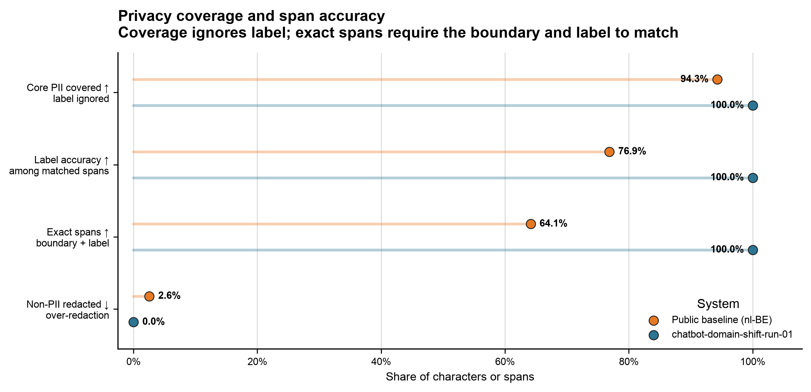
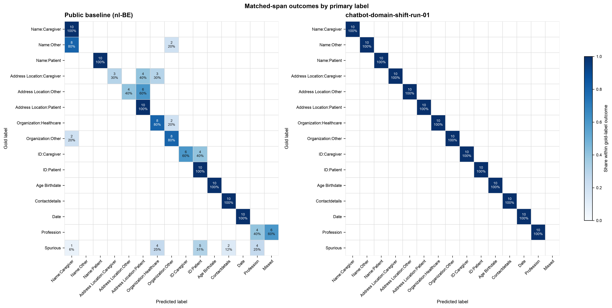

# Train and evaluate a model

Use this workflow when you have reviewed development data and a separate,
reviewed test set. Development data may influence training decisions; test
answers must remain unseen until the final evaluation.

You can follow either of two training routes:

| Goal | Route |
|---|---|
| Explore whether training works | One ordinary fit |
| Produce a study or release result | Select the training duration, then restart and refit on all development data |

If you only want to evaluate existing predictions, skip directly to
[Evaluate predictions](#5-evaluate-predictions).

## Before you begin

You need:

- a MedDeID project that was split before review;
- completed train, validation, and test assignments whose document IDs still
  match those project splits; and
- a training configuration that identifies the starting model and language
  profile.

See [Prepare and annotate data](prepare-and-annotate.md) if those reviewed
files do not exist yet.

Install the released tools:

```bash
python -m pip install \
  meddeid-data \
  'meddeid-training[train]' \
  'meddeid-eval[infer,plots]'
```

The training extra also installs `meddeid`, which is used later to generate
predictions from the exported model. If you only need to score and plot
predictions that already exist, install `meddeid-eval[plots]` instead.

## 1. Prepare the training files

<span class="source-label">Owner: meddeid-data</span>

Pass the three completed assignments to `prepare-training`:

```bash
meddeid-data project prepare-training my-project \
  --selection-train my-project/assignments/train-reviewed.jsonl \
  --selection-validation my-project/assignments/validation-reviewed.jsonl \
  --test-gold my-project/assignments/test-reviewed.jsonl \
  --output prepared-data/experiment-01
```

The command verifies completion, document membership, text, labels, and
checksums before creating three views under `prepared-data/experiment-01/`:

| Directory | What it contains | Use it for |
|---|---|---|
| `fit` | Separate train, validation, and test files | One ordinary experiment |
| `selection` | Train and validation files; the test file is empty | Choosing the training duration without seeing test answers |
| `refit` | All development documents for training and the sealed test set | Restarting, fitting all development data, and evaluating once |

Use `--development` instead of the two `--selection-*` options only when train
and validation were deliberately reviewed as one combined development
assignment.

`--output` defaults to `my-project/prepared` for compatibility. Give different
data or split snapshots distinct output directories. When several training
runs use the same prepared snapshot, reuse this directory and give every
training invocation a distinct `--run` directory instead.

The command does not modify the reviewed source files and will not overwrite a
non-empty `prepared/` directory.

## 2. Create the training configuration

<span class="source-label">Owner: meddeid-training</span>

Save a small YAML file such as `training.yaml`:

```yaml
model_name: stighellemans/meddeid-dutch-synth
model_revision: <immutable-hub-revision>
language_profile: nl-BE
device: auto
epochs: 12
seed: 42
save_best_metric: entity_f1
early_stopping_patience: 3
early_stopping_min_delta: 0.001
early_stopping_min_epochs: 3
```

`model_name` is the model from which training starts. Use its immutable Hub
revision so separate runs cannot resolve different model versions. You can
inspect the model and copy its reported revision with:

```bash
meddeid model-info \
  --model stighellemans/meddeid-dutch-synth
```

For English data, use the English starting model and `en-GB` or `en-US`. When
one training dataset deliberately contains both profiles, replace
`language_profile` with:

```yaml
language_profiles:
  - en-GB
  - en-US
```

The remaining training parameters have defaults. Add or change them only when
they are part of the experiment you intend to run. The
[`meddeid-training` repository](https://github.com/stighellemans/meddeid-training)
documents the complete configuration.

In the configuration above, `epochs` is a ceiling. Selection keeps the absolute
best validation checkpoint and stops after three epochs without a meaningful
validation improvement, beginning after epoch 3. Refit then restarts from the
pinned source model and trains on all development data for the selected count;
it does not use its now in-sample validation metrics for another selection.
This reduces overfitting risk, but it cannot replace a sufficiently large,
representative validation split and a test set that is consulted only once.

## 3. Run one ordinary fit

Use this route for exploration or an ordinary train/validation/test
experiment:

```bash
meddeid-train fit \
  --config training.yaml \
  --data prepared-data/experiment-01/fit \
  --run runs/experiment-01/fit
```

Training uses the validation set to retain the best checkpoint, then evaluates
that checkpoint on the test set. The selected checkpoint is written to
`runs/experiment-01/fit/checkpoints/best.pt`.

Do not use repeated ordinary fits on the same test set to select
hyperparameters. Once test results influence another training decision, the
test set is no longer independent.

## 4. Select and refit for a study or release

Use this two-stage route when the final test result must remain independent of
training-duration selection.

First, select the number of epochs using only the development train and
validation data:

```bash
meddeid-train select-epochs \
  --config training.yaml \
  --data prepared-data/experiment-01/selection \
  --run runs/experiment-01/selection
```

This writes the selected epoch count to
`runs/experiment-01/selection/run.json`. The test file in this view is empty,
so this stage cannot score the test set.

Then restart from the original model and train on all development data for that
fixed number of epochs:

```bash
meddeid-train refit \
  --config training.yaml \
  --selection runs/experiment-01/selection/run.json \
  --data prepared-data/experiment-01/refit \
  --run runs/experiment-01/refit
```

Refit does not continue from the selection checkpoint. It starts again from the
same model revision, combines the development train and validation data, and
evaluates once on the sealed test set.

## Export the trained model

Export the checkpoint from the route you chose. This example uses the refit
run; use the corresponding `runs/experiment-01/fit` paths after an ordinary
fit:

```bash
meddeid-train export \
  --checkpoint runs/experiment-01/refit/checkpoints/best.pt \
  --run-metadata runs/experiment-01/refit/train_metrics.json \
  --output release/my-model
```

The `release/my-model` directory is a self-contained MedDeID model bundle. Use
that exported directory—not an in-memory model or an unexported checkpoint—for
the final inference and evaluation.

## 5. Evaluate predictions

<span class="source-label">Owner: meddeid-eval</span>

Generate predictions from the exact exported bundle. The example uses the
refit test view; use `prepared/fit/test.jsonl` for an ordinary fit:

```bash
meddeid batch prepared-data/experiment-01/refit/test.jsonl \
  --model release/my-model \
  --output predictions/test.jsonl
```

Run the complete paper-style evaluation battery against the unchanged test
gold:

```bash
meddeid-eval battery \
  --gold prepared-data/experiment-01/refit/test.jsonl \
  --predictions predictions/test.jsonl \
  --name my-model \
  --output-dir results/battery
```

The command reads `metadata.lang` from the gold data and automatically runs the
matching public MedDeID baseline on the same documents. It produces a Markdown
report, aggregate and per-label CSV/JSON tables, PNG/PDF figures, a primary-label
confusion matrix with explicit missed and spurious outcomes, subannotation
detected-versus-missed coverage, and paired 95% intervals from 10,000
complete-document bootstrap samples.

The main figure keeps four outcomes in one panel: label-agnostic core-PII
coverage, primary-label accuracy among one-to-one matched overlapping spans,
exact-span F1, and non-PII redaction. This makes boundary, label-assignment,
privacy-coverage, and over-redaction failures distinguishable at a glance.

Subannotation categories are gold-only analysis labels; MedDeID does not predict
them. They therefore have a coverage matrix rather than a predicted-subcategory
confusion matrix.

For a lower-level single-system score without baseline inference or uncertainty:

```bash
meddeid-eval score \
  --gold prepared-data/experiment-01/refit/test.jsonl \
  --predictions predictions/test.jsonl \
  --name my-model \
  --output results/my-model.json
```

The result includes exact-span and character-level metrics, core-PII recall,
and unnecessary redaction outside the reviewed identifiers. Detailed
subannotation metrics appear only when the test gold contains those optional
labels.

## Compare systems and create figures

To compare another system, run it in its own environment and convert its
predictions to the MedDeID result format. Score it against the same gold file
with the same `meddeid-eval` version.

Render one or more score files together:

```bash
meddeid-eval plot \
  --scores results/my-model.json results/comparator.json \
  --output-dir results/plots
```

The command writes PNG and searchable PDF figures. Consult the
[`meddeid-eval` repository](https://github.com/stighellemans/meddeid-eval)
for metric definitions, stability analysis, and additional plot options.

The following figures illustrate this output using a synthetic Dutch chatbot
domain-shift experiment. The 60-document corpus was divided into 40 training,
10 validation, and 10 sealed test documents; all 14 primary labels were
represented in every split.

<figure markdown="span">
  { loading=lazy }
  <figcaption>
    The headline panel separates privacy coverage, matched-span label accuracy,
    exact boundary-and-label performance, and unnecessary redaction. On this
    constructed test set, fine-tuning raised exact-span F1 from 64.1% to 100%
    and label accuracy from 76.9% to 100%.
  </figcaption>
</figure>

<figure markdown="span">
  { loading=lazy }
  <figcaption>
    Gold labels are rows and predictions are columns. The public baseline shows
    role and subtype confusion, including Other names predicted as caregivers,
    caregiver IDs predicted as patient IDs, address-role confusion, missed
    professions, and spurious predictions. The fine-tuned candidate is diagonal
    on this synthetic test partition.
  </figcaption>
</figure>

These are integration-test illustrations, not estimates of clinical or
production performance. Real deployment claims require independently reviewed,
representative local test data.

## Keep with the result

Keep enough information to identify the complete run:

- the reviewed development and test manifests;
- the fixed project split;
- `training.yaml` and its random seed;
- the starting model and immutable revision;
- the selected language profile and package versions;
- the training run metadata and exported bundle;
- the prediction manifest, score file, and exact commands; and
- relevant hardware and measured runtime information.

See [Artifact lineage](../concepts/artifact-lineage.md) for how these files
connect.
